# 💖 Shine Gupta - Data Scientist Portfolio

> A beautifully crafted, romantic-themed portfolio showcasing data science expertise with smooth animations and modern design

[](https://astro.build/)
[](https://www.typescriptlang.org/)
[](https://sass-lang.com/)
[](https://greensock.com/)

---

## 🌟 Project Overview

```mermaid
flowchart TD
    A[🎨 Portfolio Website] --> B[💕 Romantic Theme]
    A --> C[📊 Data Science Focus]
    A --> D[⚡ Modern Tech Stack]
    
    B --> B1[🌸 Rose Pink Palette]
    B --> B2[✨ Glassmorphism Cards]
    B --> B3[🎭 Smooth Animations]
    
    C --> C1[👩‍💻 Professional Showcase]
    C --> C2[🏆 Achievements Display]
    C --> C3[🛠️ Tech Stack Highlight]
    
    D --> D1[🚀 Astro Framework]
    D --> D2[🎨 SCSS Modules]
    D --> D3[📱 PWA Ready]
    
    style A fill:#D7ABC5,stroke:#C189A8,stroke-width:3px,color:#000
    style B fill:#E8C7DA,stroke:#D7ABC5,stroke-width:2px
    style C fill:#F5F5F5,stroke:#C8C8C8,stroke-width:2px
    style D fill:#6366F1,stroke:#4F46E5,stroke-width:2px,color:#fff
```



## 🎯 Features

### 🎨 **Design System**

```mermaid
graph LR
    A[🎨 Design System] --> B[Color Palette]
    A --> C[Typography]
    A --> D[Components]
    
    B --> B1[🌸 Rose Pink #D7ABC5]
    B --> B2[⚫ Pure Black #000000]
    B --> B3[🌫️ Soft Gray #ECECEC]
    
    C --> C1[📝 Inter - Body Text]
    C --> C2[🔤 Bebas Neue - Headings]
    C --> C3[💻 JetBrains Mono - Code]
    
    D --> D1[💳 Floating Cards]
    D --> D2[🔘 Gradient Buttons]
    D --> D3[📊 Progress Bars]
    
    style A fill:#D7ABC5,stroke:#C189A8,stroke-width:3px
    style B fill:#E8C7DA,stroke:#D7ABC5,stroke-width:2px
    style C fill:#F8F8F8,stroke:#ECECEC,stroke-width:2px
    style D fill:#6366F1,stroke:#4F46E5,stroke-width:2px,color:#fff
```


### ⚡ **Technical Architecture**

```mermaid
graph TB
    A[🏗️ Project Structure] --> B[Frontend]
    A --> C[Styling]
    A --> D[Animation]
    A --> E[SEO & PWA]
    
    B --> B1[🚀 Astro Framework]
    B --> B2[📦 Component-Based]
    B --> B3[🔧 TypeScript Support]
    
    C --> C1[🎨 SCSS Modules]
    C --> C2[📱 Responsive Design]
    C --> C3[🌈 CSS Custom Properties]
    
    D --> D1[✨ GSAP Animations]
    D --> D2[🎭 Scroll Triggers]
    D3[🎪 Floating Animations]
    D --> D3
    
    E --> E1[🔍 SEO Optimized]
    E --> E2[📱 PWA Ready]
    E --> E3[🎯 Web Manifest]
    
    style A fill:#D7ABC5,stroke:#C189A8,stroke-width:3px
    style B fill:#10B981,stroke:#059669,stroke-width:2px,color:#fff
    style C fill:#F59E0B,stroke:#D97706,stroke-width:2px,color:#fff
    style D fill:#8B5CF6,stroke:#7C3AED,stroke-width:2px,color:#fff
    style E fill:#EF4444,stroke:#DC2626,stroke-width:2px,color:#fff
```


## 🚀 Getting Started

### Prerequisites
- Node.js 18+ 
- npm or yarn

### Installation

1. **Clone the repository**
   ```bash
   git clone https://github.com/username/shine-gupta-portfolio.git
   cd shine-gupta-portfolio
   ```

2. **Install dependencies**
   ```bash
   npm install
   # or
   yarn install
   ```

3. **Start development server**
   ```bash
   npm run dev
   # or
   yarn dev
   ```

4. **Open in browser**
   ```
   http://localhost:4321
   ```

## 📁 Project Structure

```
📦 Portfolio
├── 🎨 src/
│   ├── 🧩 components/
│   │   ├── Hero.astro
│   │   └── SEO.astro
│   ├── 📄 layouts/
│   │   └── Layout.astro
│   ├── 📱 pages/
│   │   └── index.astro
│   └── 🎨 assets/
│       ├── styles/
│       │   ├── _colours.scss
│       │   ├── _fonts.scss
│       │   └── Hero.module.scss
│       └── images/
├── 🌐 public/
│   ├── site.webmanifest
│   ├── favicon.ico
│   └── icons/
└── ⚙️ astro.config.mjs
```

## 🎭 Animation System


## 🎨 Component Showcase

### 💳 **Floating Cards System**
- **Data Scientist Card**: Role overview with performance stats
- **Experience Card**: Years of expertise with industry focus
- **Tech Stack Card**: 6 key technologies in responsive grid
- **Achievements Card**: Awards and publications with icons
- **Current Focus Card**: Active projects with progress indicators
- **Education Card**: Academic background and certifications

### 🎯 **Interactive Elements**

```mermaid
graph LR
    A[🎯 Interactions] --> B[Hover Effects]
    A --> C[Scroll Animations] 
    A --> D[Button Actions]
    
    B --> B1[📈 Card Lift & Glow]
    B --> B2[🎨 Color Transitions]
    B --> B3[🔄 Transform Scale]
    
    C --> C1[📜 Parallax Background]
    C --> C2[⬆️ Fade In Elements]
    C --> C3[🎪 Staggered Reveals]
    
    D --> D1[🔗 View Projects]
    D --> D2[📧 Contact Me]
    D --> D3[⬇️ Scroll Indicator]
    
    style A fill:#D7ABC5,stroke:#C189A8,stroke-width:3px
    style B fill:#E8C7DA,stroke:#D7ABC5,stroke-width:2px
    style C fill:#F8F8F8,stroke:#ECECEC,stroke-width:2px
    style D fill:#6366F1,stroke:#4F46E5,stroke-width:2px,color:#fff
```


## 🎨 Design Tokens

### 🌈 **Color Palette**
| Color | Hex | Usage |
|-------|-----|-------|
| 🌸 Rose Pink | `#D7ABC5` | Primary brand, accents |
| ⚫ Pure Black | `#000000` | Text, backgrounds |
| 🌫️ Soft Gray | `#ECECEC` | Secondary text, borders |
| 🔵 Data Blue | `#6366F1` | Tech elements, links |
| 💜 Insight Purple | `#8B5CF6` | Analytics, highlights |

### 📝 **Typography Scale**
| Size | rem | px | Usage |
|------|-----|----|----|
| xs | 0.75 | 12 | Labels, tags |
| sm | 0.875 | 14 | Small text |
| base | 1 | 16 | Body text |
| lg | 1.125 | 18 | Large body |
| xl | 1.25 | 20 | Subheadings |
| 2xl | 1.5 | 24 | Card titles |
| 3xl | 1.875 | 30 | Section headers |
| 4xl | 2.25 | 36 | Page titles |
| 5xl | 3 | 48 | Hero text |
| 6xl | 3.75 | 60 | Display text |

## 📱 Responsive Breakpoints

```mermaid
graph LR
    A[📱 Responsive Design] --> B[Mobile First]
    A --> C[Flexible Grid]
    A --> D[Adaptive Cards]
    
    B --> B1[📱 480px - Mobile]
    B --> B2[📱 768px - Tablet]
    B --> B3[💻 1024px - Desktop]
    B --> B4[🖥️ 1200px+ - Large]
    
    C --> C1[🔄 Flexible Layout]
    C --> C2[📏 Fluid Typography]
    C --> C3[🎯 Touch Targets]
    
    D --> D1[📦 Card Scaling]
    D --> D2[👁️ Selective Visibility]
    D --> D3[📐 Grid Adaptation]
    
    style A fill:#D7ABC5,stroke:#C189A8,stroke-width:3px
    style B fill:#10B981,stroke:#059669,stroke-width:2px,color:#fff
    style C fill:#F59E0B,stroke:#D97706,stroke-width:2px,color:#fff
    style D fill:#8B5CF6,stroke:#7C3AED,stroke-width:2px,color:#fff
```



## 🛠️ Development Workflow

```mermaid
gitgraph
    commit id: "Initial Setup"
    branch feature/hero-section
    commit id: "Hero Component"
    commit id: "GSAP Animations"
    commit id: "Floating Cards"
    checkout main
    merge feature/hero-section
    branch feature/styling
    commit id: "SCSS Architecture"
    commit id: "Color System"
    commit id: "Typography Scale"
    checkout main
    merge feature/styling
    branch feature/seo
    commit id: "SEO Component"
    commit id: "Web Manifest"
    commit id: "PWA Features"
    checkout main
    merge feature/seo
    commit id: "Production Build"
```

## 🚀 Build & Deploy

### Development
```bash
npm run dev          # Start dev server
npm run build        # Build for production
npm run preview      # Preview production build
```

### Production Checklist
- [ ] All images optimized
- [ ] Icons generated (16x16 to 512x512)
- [ ] Web manifest configured
- [ ] SEO meta tags complete
- [ ] Analytics tracking added
- [ ] Performance tested
- [ ] Cross-browser compatibility verified

## 🎯 Performance Optimizations


## 🤝 Contributing

1. Fork the repository
2. Create feature branch (`git checkout -b feature/amazing-feature`)
3. Commit changes (`git commit -m 'Add amazing feature'`)
4. Push to branch (`git push origin feature/amazing-feature`)
5. Open a Pull Request

## 📝 License

This project is licensed under the MIT License - see the [LICENSE](LICENSE) file for details.

## 💕 Made with Love

This portfolio was crafted with love, combining romantic aesthetics with professional data science presentation. The rose pink theme represents the passion for data science while maintaining elegance and sophistication.

---

<div align="center">

### 🌟 **Built with Modern Technologies** 🌟

[](https://astro.build/)
[](https://www.typescriptlang.org/)
[](https://sass-lang.com/)
[](https://greensock.com/)

**Made with 💖 for the love of data science and beautiful web experiences**

</div>